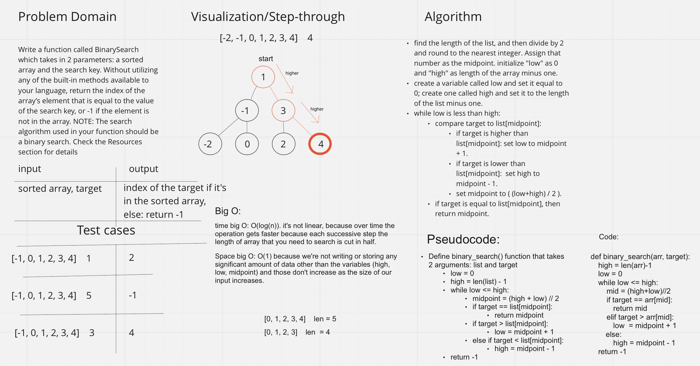

# Binary Search of Sorted Array
1. Write a function called BinarySearch which takes in 2 parameters: a sorted array and the search key. Without utilizing any of the built-in methods available to your language, return the index of the array’s element that is equal to the value of the search key, or -1 if the element is not in the array.

1. NOTE: The search algorithm used in your function should be a binary search.
Check the Resources section for details

## Whiteboard Process


## Approach & Efficiency
1. We used Binary Search Tree Algorithim.
1. The Big O (time) for our algorithm is O(log(n)).
1. The Big O (space) for our algorithm is O(1)
1. Our algorithm is a little more efficient than linear because it actually gets quicker over time.
1. That is because the length of the array the we need to search is cut in half each iteration of the program.

Code: 
```
def bst(list, target):
	low = 0
	high = len(list) - 1
	while low <= high:
		mid = low + ((high - low) // 2)
		if list[mid] == target:
			return mid
		elif target < list[mid]:
			high = mid - 1
		elif target > list[mid]:
			low = mid + 1
	return -1
    