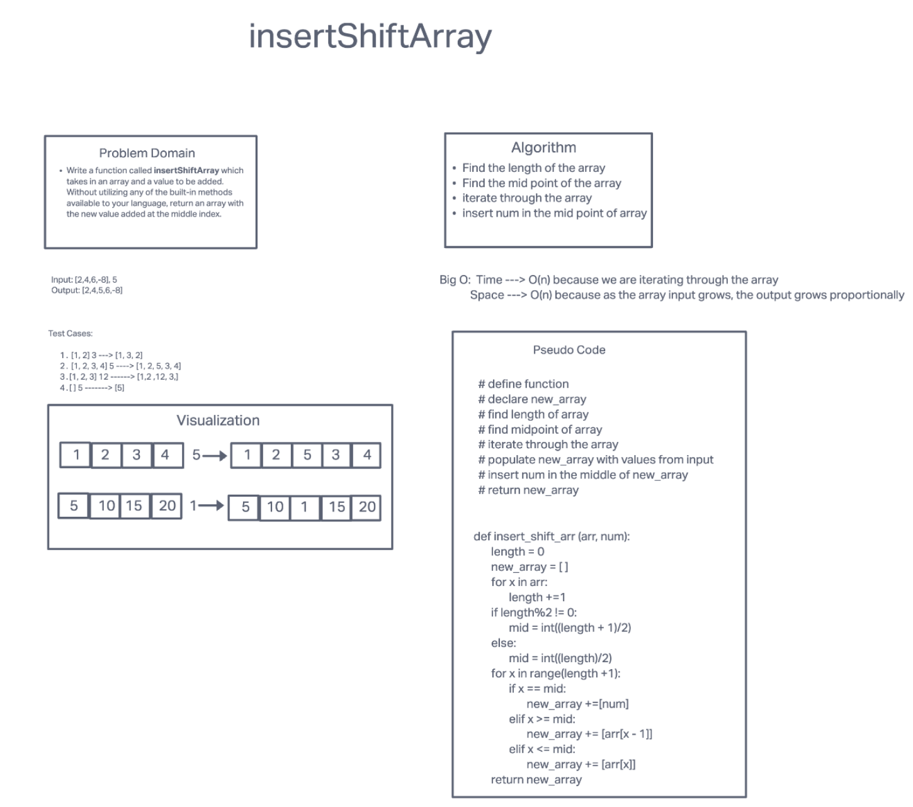

# Insert to Middle of an Array
Write a function called insertShiftArray which takes in an array and a value to be added. Without utilizing any of the built-in methods available to your language, return an array with the new value added at the middle index.
Example
1. Input                   
    1. [2,4,6,-8], 5	        
    1. [42,8,15,23,42], 16
1. Output
    1. [2,4,5,6,-8]
    1. [42,8,15,16,23,42]

## Whiteboard Process

## Approach & Efficiency
1. We looped through the array to find the length of the array.
1. We divided the length of the array by 2 to find the midpoint mark
1. We utilized an if statement inside a for loop that cehcks for midpoint index.
1. if the index is equal to midpoint, num is added to the array. 
1. Big O:
    1. Time - O(n)
    1. Space - O(n)

# Stretch Goal: Delete Middle number of an Array
Write a second function that removes an element from the middle index and shifts other elements in the array to fill the new gap.

Example
1. Input                   
    1. [2,4,6,-8]	        
    1. [42,8,15,23,42]
1. Output
    1. [2,4,-8]
    1. [42,8,23,42]

## Whiteboard Process

## Approach & Efficiency
1. We looped through the array to find the length of the array.
1. We divided the length of the array by 2 to find the midpoint mark
1. We utilize an if statement inside a for loop that cehcks for midpoint index. 
1. If the index is equal to midpoint the number is ignored and not added to the array that will be returned
1. Big O:
    1. Time - O(n)
    1. Space - O(n)

