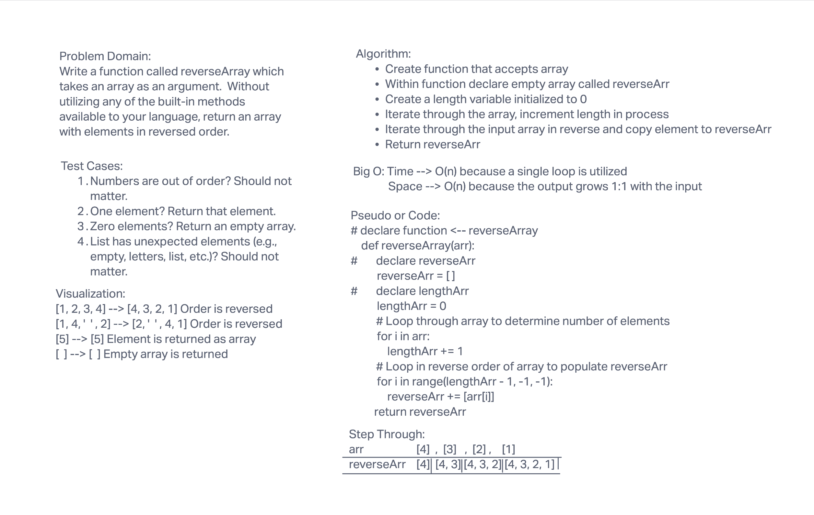

# Reverse an Array
1. Write a function called reverseArray which takes an array as an argument. Without utilizing any of the built-in methods available to your language, return an array with elements in reversed order.

## Whiteboard Process

## Approach & Efficiency

1. We utilize a for loop that loops backwards to access each element of the array starting from the very end. We use those elements to populate a new array and then returned that array.
1. Big O:
    1. Time - O(n)
    1. Space - O(n)

