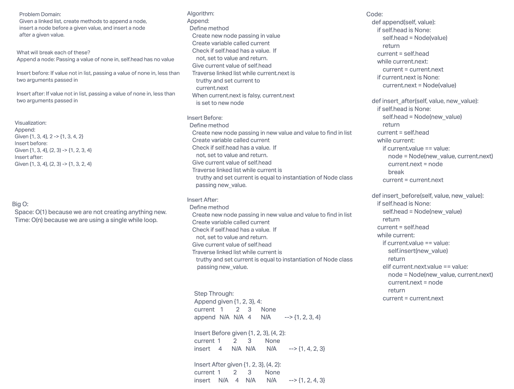
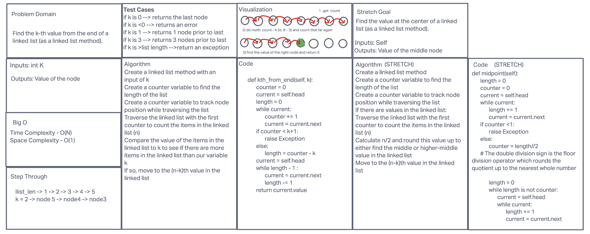

# Linked List
1. A linked list is a type of linked list that is unidirectional, that is, it can be traversed in only one direction from head to the last node (tail).

1. Each element in a linked list is called a node. A single node contains data and a pointer to the next node which helps in maintaining the structure of the list.

## Challenge 05
Create a Linked List class
Within your Linked List class, include a head property.
Upon instantiation, an empty Linked List should be created.
The class should contain the following methods
1. insert
    Arguments: value
    Returns: nothing

1.  includes
    Arguments: value
    Returns: Boolean

1. to string
    Arguments: none

## Approach & Efficiency
1. We implemented a Big O time complexity of O(n) for the to_string() and includes() methods.
1. We implemented a Big O time complexity of O(1) for the insert() method
1. We implemeted a Big O space complexcity of O(1) for all the methods of the linked list
## API

1. to_string() -> returns a a string representing all the values in the Linked List, formatted as: "{ a } -> { b } -> { c } -> NULL"
1. insert() -> Adds a new node with that value to the head of the list with an O(1) Time performance.
1. includes() -> Indicates whether that value exists as a Node’s value somewhere within the list.

 

## Challenge 06 Summary
1. Write the following methods for the Linked List class:
    1. append
        arguments: new value
        adds a new node with the given value to the end of the list
    1. insert before
        arguments: value, new value
        adds a new node with the given new value immediately before the first node that has the value specified
    1. insert after
        arguments: value, new value
        adds a new node with the given new value immediately after the first node that has the value specified

## Whiteboard Process

## Approach & Efficiency
Big O time: O(n)
Big O space: O(1)

## Solution

[linked to code](./linked_list.py)

## Challenge 07 Summary
1. Write the following method for the Linked List class:
kth from end
argument: a number, k, as a parameter.
Return the node’s value that is k places from the tail of the linked list.
You have access to the Node class and all the properties on the Linked List class as well as the methods created in previous challenges.

## Whiteboard Process

## Approach & Efficiency
Big O time: O(n)
Big O space: O(1)

## Solution

[linked to code](./linked_list.py)