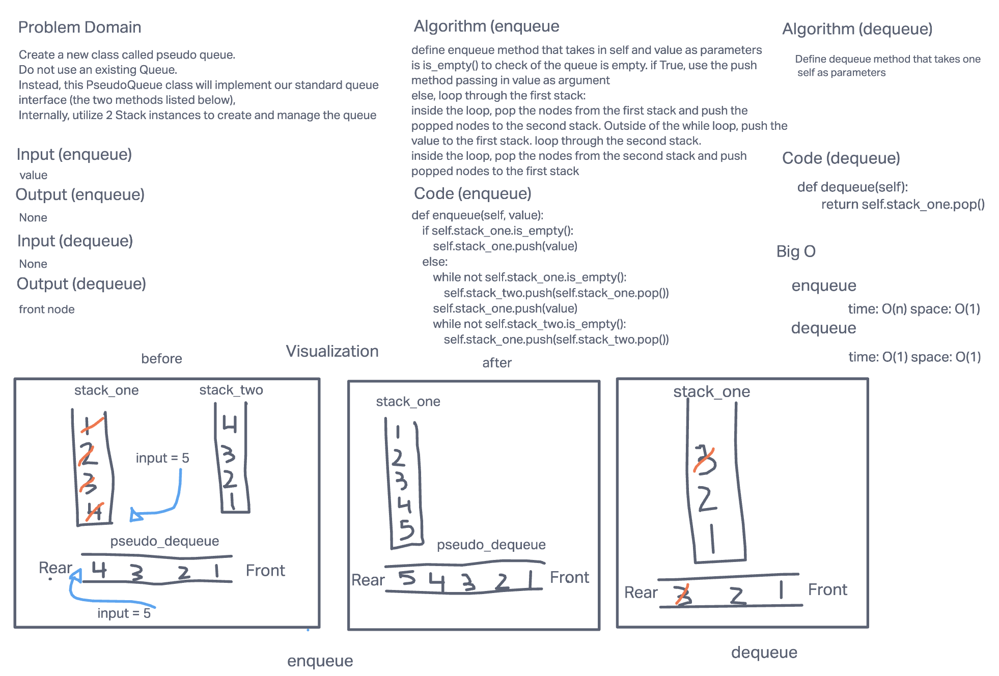

# Stacks and Queues
1. Create a Node class that has properties for the value stored in the Node, and a pointer to the next node.
1. Create a Stack class that has a top property. It creates an empty Stack when instantiated
1. Create a Queue class that has a front property. It creates an empty Queue when instantiated.
## Challenge
    Stack
    1. Create a Stack class that has a top property. It creates an empty Stack when instantiated. This object should be aware of a default empty value assigned to top when the stack is created. The class should contain the following methods:
    1. push
        Arguments: value
        adds a new node with that value to the top of the stack with an O(1) Time performance.
    1. pop
        Arguments: none
        Returns: the value from node from the top of the stack
        Removes the node from the top of the stack
        Should raise exception when called on empty stack
    1. peek
        Arguments: none
        Returns: Value of the node located at the top of the stack
        Should raise exception when called on empty stack is empty
        Arguments: none
        Returns: Boolean indicating whether or not the stack is empty.
    Queue
    1. Create a Queue class that has a front property. It creates an empty Queue when instantiated. This object should be aware of a default empty value assigned to front when the queue is created. The class should contain the following methods:
    1. enqueue
        Arguments: value
        adds a new node with that value to the back of the queue with an O(1) Time performance.
    1. dequeue
        Arguments: none
        Returns: the value from node from the front of the queue
        Removes the node from the front of the queue
        Should raise exception when called on empty queue
    1. peek
        Arguments: none
        Returns: Value of the node located at the front of the queue
        Should raise exception when called on empty stack
    1. is empty
        Arguments: none
        Returns: Boolean indicating whether or not the queue is empty

## Approach & Efficiency
Stack
The big O for pop, push, peek and isEmpty for space and time is complexity O(1)
Queue
The big O for enqueue, dequeue, peek and isEmpty for space and time is O(1)
## API
Stack 
    1. push - Adds a new node with that value to the top of the stack with an O(1) Time performance.
    1. pop - Removes the node from the top of the stack
    1. peek - Returns: Value of the node located at the top of the stack
    1. is_empty - returns: Boolean indicating whether or not the stack is empty.

Queue
    1. enqueue - adds a new node with that value to the back of the queue with an O(1) Time performance.
    1. dequeue - Removes the node from the front of the queue
    1. peek- returns: Value of the node located at the front of the queue
    1. is empty - returns: Boolean indicating whether or not the queue is empty


# PseudoQueue

## Challenge Summary
1. Create a new class called pseudo queue.
1. Do not use an existing Queue.
1. Instead, this PseudoQueue class will implement our standard queue interface (the two methods listed below),
1. Internally, utilize 2 Stack instances to create and manage the queue

## Whiteboard Process


## Approach & Efficiency
the enqueue() method has a time complexity of O(n) and has a space complexity of O(1)
the dequeue() method has a time complexity of O(1) and has a space complexity of O(1)

## Solution
1. to run the code:
1. go to stack_and_queue [file](stack_queue_pseudo.py)
1. copy the following code to __main__ if theyre not in their already:
    ```
    s = PseudoQueue()
    s.enqueue(1)
    s.enqueue(2)
    s.enqueue(3)
    s.enqueue(4)
    s.dequeue()
    s.dequeue()
    s.dequeue()
    print(s)
    ```
1. run "python3 stack_queue_pseudo.py" command in the terminal
1. the output should be:
    { 4 } -> NULL
