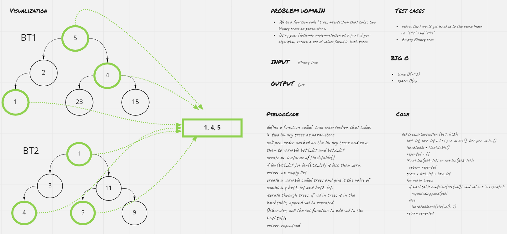

# Challenge Summary
1. Write a function called tree_intersection that takes two binary trees as parameters.
1. Using your Hashmap implementation as a part of your algorithm, return a set of values found in both trees.
## Whiteboard Process

## Approach & Efficiency
Big O
- Time: O(n^2)
- Space: O(n)

## Solution
[link to code](tree_intersection.py)