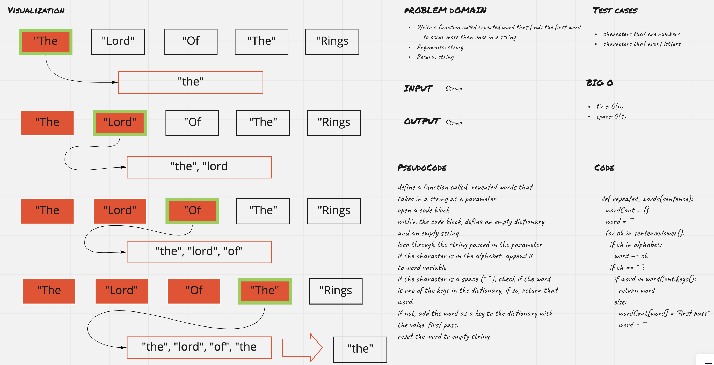

# Challenge Summary
1. Write a function called repeated word that finds the first word to occur more than once in a string
- Arguments: string
- Return: string

## Whiteboard Process

## Approach & Efficiency
Big O
- time O(n)
- space O(1)

## Solution
[link to code](hash_repeated_word.py)