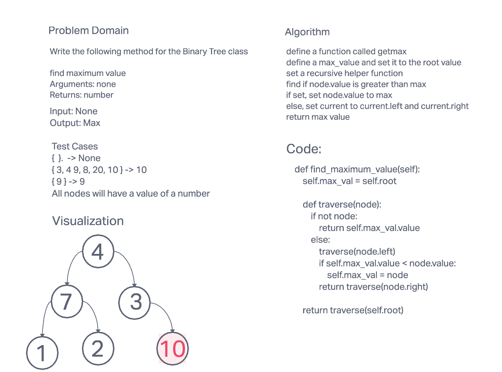
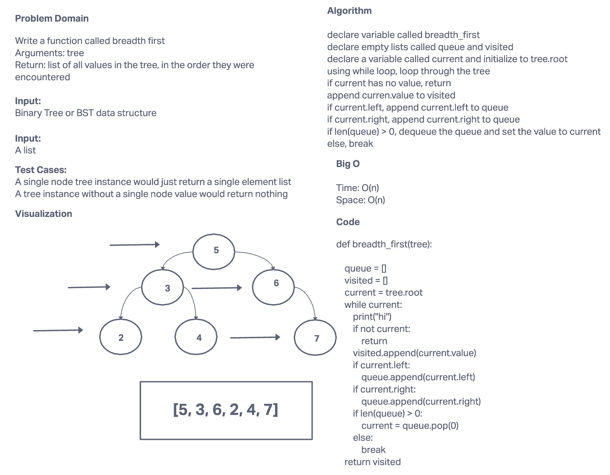
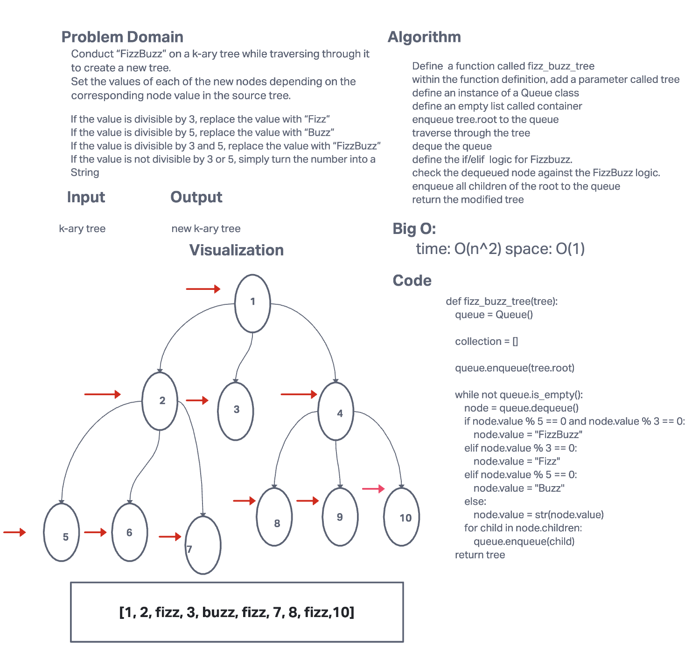

# Trees
1. Create a tree data structure with Node Class
2. Create Binary Tree parent class and Binary Search Tree subclass of Binary Tree

## Challenge 15

1. Node
- Create a Node class that has properties for the value stored in the node, the left child node, and the right child node.
1. Binary Tree
- Create a Binary Tree class
- Define a method for each of the depth first traversals:
  - pre order
  - in order
  - post order which returns an array of the values, ordered appropriately.
1. Binary Search Tree
  - Create a Binary Search Tree class
  - This class should be a sub-class (or your languages equivalent) of the Binary Tree Class, with the following additional methods:
  - Add
    - Arguments: value
    - Return: nothing
    - Adds a new node with that value in the correct location in the binary search tree.
  - Contains
    - Argument: value
    - Returns: boolean indicating that the value is in the tree at least once.

## Approach & Efficiency

1. Binary Tree
   - pre-order
     - time O(n) space O(h)
   - in-order
     - time O(n) space O(h)
   - post-order
     - time O(n) space O(h)

2. Binary Search Tree
   - Add - time O(logn) space O(1)
   - Contains - time O(logn) space O(1)

## API

1. Binary Tree
   - Inorder (Left, Root, Right)
   - Preorder (Root, Left, Right)
   - Postorder (Left, Right, Root)

2. Binary Search Tree
   - Add - Adds a new node with that value in the correct location in the binary search tree.
   - Contains - Finds if a value is in the tree at least once.

## Challenge 16

1. Find maximum value

## Approach & Efficiency

 
## Approach & Efficiency

1. Binary Tree
   - find maximum
     - time O(n) space O(h)

## API

1. Binary Tree
   - find maximum - find the maximum value in the binary tree data structure

## Challenge 17

1. Return: list of all values in the tree, in the order they were encountered

## Approach & Efficiency

 
## Approach & Efficiency

1. Binary Tree
   - breadth first search
     - time O(n) space O(n)

## API

1. breadth_first()
   - Return: list of all values in the tree, in the order they were encountered

## Challenge 18

1. Conduct “FizzBuzz” on a k-ary tree while traversing through it to create a new tree.

1. Set the values of each of the new nodes depending on the corresponding node value in the source tree.

## Approach & Efficiency

 
## Approach & Efficiency

1. K-Ary Tree
   - breadth first search
     - time O(n^1) space O(1)

## API

1. fizz_buzz_tree()
  - takes in a parameter and modify the values in place based off of the fizzbuzz logic.
  - returns the modified tree
1. [Link to code](tree_fizz_buzz.py)
