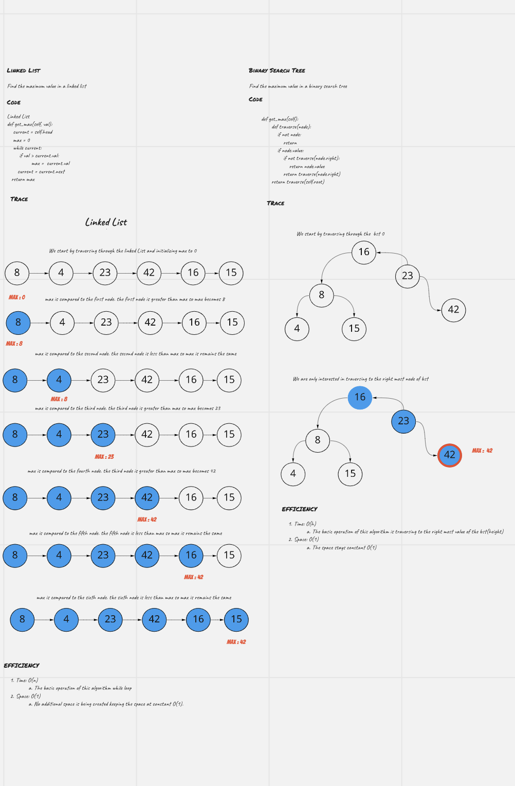

# Blog Notes: Quick Sort / Find maximum valued of linked list and binary search tree

##  Challenge Summary
In your blog article, visually show the output of processing this input array:

[8,4,23,42,16,15]

Implementation
Provide a visual step through for each of the sample arrays based on the provided pseudo code
Convert the pseudo-code into working code in your language
Present a complete set of working tests

## Whiteboard Process

## Solution
[Link to Code/Solution](quick_sort.py)